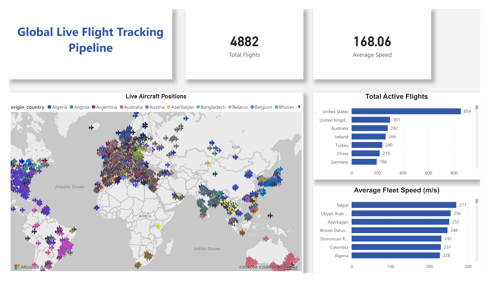
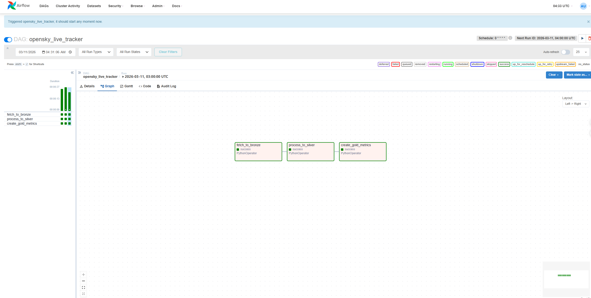

# ✈️ OpenSky Data Pipeline (Co-op Project)

This is an end-to-end data pipeline I built to learn the Medallion Architecture. 
It pulls real-time flight data from the OpenSky API, cleans it with Python, 
and stores it in Postgres for a Power BI dashboard.

---

### 📊 The Final Result (Power BI)

---

## 🚀 How to Run It
I used Docker so you don't have to install Airflow or Postgres manually.

1. Clone the repo:
   git clone https://github.com/AYMANALSABA/OpenSky-Data-Pipeline.git
   cd OpenSky-Data-Pipeline

2. Start the containers:
   docker-compose up -d

3. Open Airflow: 
   Go to http://localhost:8080 (User/Pass: airflow).

---

## 🏗 How it Works (Medallion Architecture)

- Bronze Layer: Pulls raw data from the API and saves it as a JSON file.
- Silver Layer: Uses Pandas to clean the data (fixing nulls and filtering coordinates).
- Gold Layer: Aggregates the data and loads it into PostgreSQL for the dashboard.

---

## 📂 Folders
- dags/      -> The Airflow workflow logic.
- ETL/       -> The Python scripts for data cleaning and loading.
- data/      -> (Ignored by Git) Where the JSON and CSV files are stored locally.
- config.py  -> Database connection and API settings.